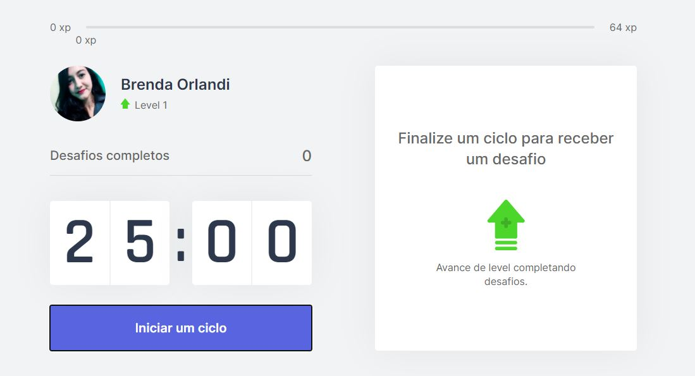
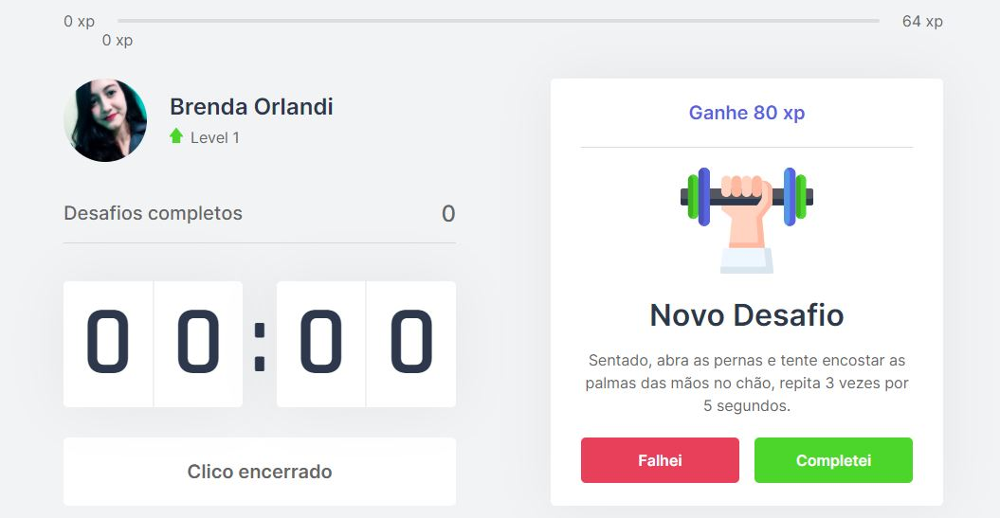
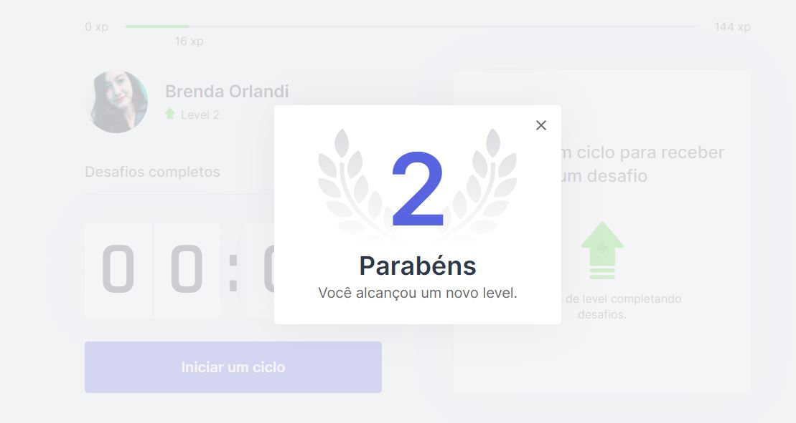
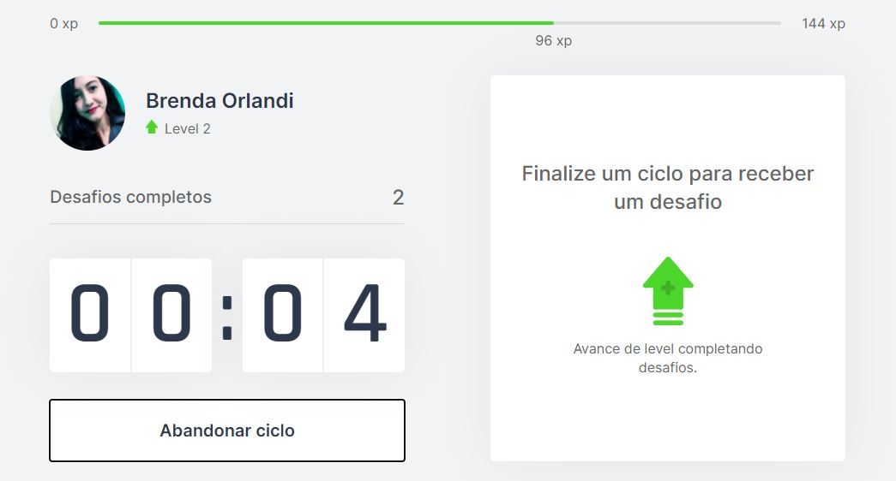

<h1 align="center">
  Style Move
</h1>

  <a href="#-tecnologias">Tecnologias</a>&nbsp;&nbsp;&nbsp;|&nbsp;&nbsp;&nbsp;
  <a href="#-projeto">Projeto</a>&nbsp;&nbsp;&nbsp;|&nbsp;&nbsp;&nbsp;
  <a href="#-layout">Layout</a>&nbsp;&nbsp;&nbsp;|&nbsp;&nbsp;&nbsp;
  <a href="#memo-licença">Licença</a>

 

  

 

## 🚀 Tecnologias

Esse projeto foi desenvolvido com as seguintes tecnologias:

- React.js (useState, useEffect e useContext).
- Typescript.
- Next.js.
- js-cookie.

## 💻 Projeto

O Style Move é uma aplicação de produtividade que usa a técnica de Pomodoro. Essa técnica consiste em ciclos com foco total na atividade que está sendo executada, intercalados com período de descanso.

Para motivar os usuários, a Style Move criou uma gameficação na aplicação, em que a cada descanso realizado e desafio feito, você vai subindo de nível.

## 🔖 Layout

<h1 align="center">
  
</h1>

<h1 align="center">
  
</h1>

<h1 align="center">
  
</h1>

<h1 align="center">
  
</h1>

## :memo: Licença

Esse projeto está sob a licença MIT. Veja o arquivo [LICENSE](.main/LICENSE.md) para mais detalhes.

---

Feito por Brenda Orlandi, referência  pela Rocketseat :wave: [Participe da nossa comunidade!](https://discordapp.com/invite/gCRAFhc)
